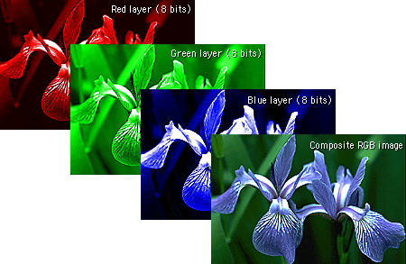
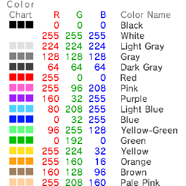
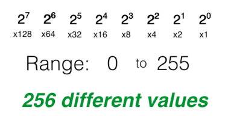
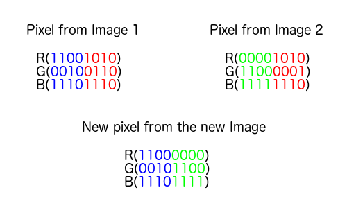
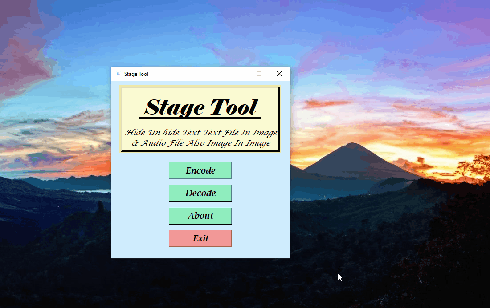

[](https://www.python.org)
[](https://www.microsoft.com/en-in/software-download/windows10)


# Stage Tool
A Simple GUI Based Steganography (LSB-Method) Tool For Hide-Unhide (Encode-Decode) Text From Image & Audio File. Also, Hide Image Behind An Image & Extract It.

**Made In Python(3.9.5) With Tkinter GUI**

## Usage

1. Hide Text or Text File Behind Any Simple Image (.jpg, .jpeg., .png). 
2. Hide Text or Text File Behind Audio (.wav).
3. Hide A Secret Image Behind Another Simple Image (.jpg, .jpeg., .png).
4. Extract Text or Text File From Image (.png). 
5. Extract Text or Text File From Audio (.wav). 
6. Extract The Secret Image From Carrier Image (.png).


## Features 

1. Simple & Clean UI.
2. Inbuilt Text Editor For Writing Text Or Preview Text After Extracting.
3. Easy To Use.


## Requirements

- opencv-python
- pillow
- click
- numpy
- wave


## Installation

- Download Repository

`Direct Download Zip` [Click Here](https://codeload.github.com/Hrishikesh7665/Stage_Tool/zip/refs/heads/main)

- Or

- Clone Repository

```
git clone https://github.com/Hrishikesh7665/Stage_Tool.git
```

- Install Required Modules

```
pip install opencv-python
```
```
pip install pillow
```
```
pip install click
```
```
pip install numpy
```
```
pip install wave
```

- Or

```
pip install -r requirements.txt
```

- Run

```
python "StageTool.py"
```


## Documentation

What Is Steganography
=====================

Steganography is the technique of hiding secret data within an ordinary, non-secret, file or message in order to avoid detection. Here we mainly use Image and Audio steganography.
			The image steganography is the process in which we hide the data within an image so that there will not be any perceived visible change in the original image. The conventional image steganography algorithm is LSB embedding algorithm.


Least Significant Bit (LSB)
===========================

I used the most basic method which is the least significant bit. A colour pixel is composed of red, green and blue, encoded on one byte. The idea is to store information in the first bit of every pixel's RGB component. In the worst case, the decimal value is different by one which is not visible to the human eye. In practice, if you don't have space to store all of your data in the first bit of every pixel you should start using the second bit, and so on. You have to keep in mind that the more your store data in an image. Store less data in a single image to avoid detection.

How It Works
------------

Hide text or text data behind in an image function in this program is based on OpenCV to hide data in images. It uses the first bit of every pixel, and every colour of an image. The code is quite simple to understand; If every first bit has been used, the module starts using the second bit, so the larger the data, the more the image is altered.


How Hidng Image Inside An Image Works
-------------------------------------

Ok, now that we know the basics of steganography, let’s learn some simple image processing concepts.

Before understanding how can we hide an image inside another, we need to understand what a digital image is.

What Is A Digital Image
-----------------------

We can describe a **digital image** as a finite set of digital values, called pixels. Pixels are the smallest individual element of an image, holding values that represent the brightness of a given color at any specific point. So we can think of an image as a matrix (or a two-dimensional array) of pixels which contains a fixed number of rows and columns.

You can read more about [Digital Image](https://en.wikipedia.org/wiki/Digital_image) In Wikipedia.


Pixel concept and color models
------------------------------

As already mentioned, pixels are the smallest individual element of an image. So, each pixel is a sample of an original image. It means, more samples provide more accurate representations of the original. The intensity of each pixel is variable. In color imaging systems, a color is typically represented by three or four component intensities such as red, green, and blue, or cyan, magenta, yellow, and black.

Here, we will work with the RGB color model. As you can imagine, the RGB color model has 3 channels, red, green and blue.



So, as you can see in the image each pixel from the image is composed of 3 values (red, green, blue) which are 8-bit values (the range is 0–255).



As we can see in the image above, for each pixel we have three values, which can be represented in binary code.

When working with binary codes, we have more significant bits and less significant bits, as you can see in the image below.



The leftmost bit is the most significant bit. If we change the leftmost bit it will have a large impact on the final value. For example, if we change the leftmost bit from 1 to 0 (11111111 to 01111111) it will change the decimal value from 255 to 127.

On the other hand, the rightmost bit is the least significant bit. If we change the rightmost bit it will have less impact on the final value. For example, if we change the leftmost bit from 1 to 0 (11111111 to 11111110) it will change the decimal value from 255 to 254. Note that the rightmost bit will change only 1 in a range of 256 (it represents less than 1%).

**In Short:** each pixel has three values (RGB), each RGB value is 8-bit (it means we can store 8 binary values) and the rightmost bits are least significant. So, if we change the rightmost bits it will have a small visual impact on the final image. This is the steganography key to hide an image inside another. Change the least significant bits from an image and include the most significant bits from the other image.




Encode The Data
---------------
Every byte of data is converted to its 8-bit binary code using ASCII values. Now pixels are read from left to right in a group of 3 containing a total of 9 values. The first 8-values are used to store the binary data. The value is made odd, if 1 occurs and even, if 0 occurs.

Decode The Data
---------------
To decode, three pixels are read at a time, till the last value is odd, which means the message is over. Every 3-pixels contain a binary data, which can be extracted by the same encoding logic. If the value if odd the binary bit is 1 else 0.


Okay that's pretty much for Image Steganography, lets talk about Audio Steganography. 

## What Is Audio Steganography

Audio Steganography is the art of covertly embedding secret messages into digital audio.

How Audio Steganography Works
-----------------------------

Same as image steganography also here we use LSB (Least Significant Bit) method to hide text behind Aduio.

We will use .wav audio file format for our carrier song. Wave is one of the most popular lossless compression format. Python has a native library called “wave” that provides us basic tools to manipulate audio data.

Then, we will perform logical AND operation between each byte of carrier audio (the “song”) and a bit mask that resets the LSB of carrier byte. Then we will perform a simple logical OR operation between the modified carrier byte and the next bit (0 or 1) from the secret message.

Thats All For The Code But You Can Read More About Stenography [HERE](https://core.ac.uk/download/pdf/234671204.pdf)


## Demo


